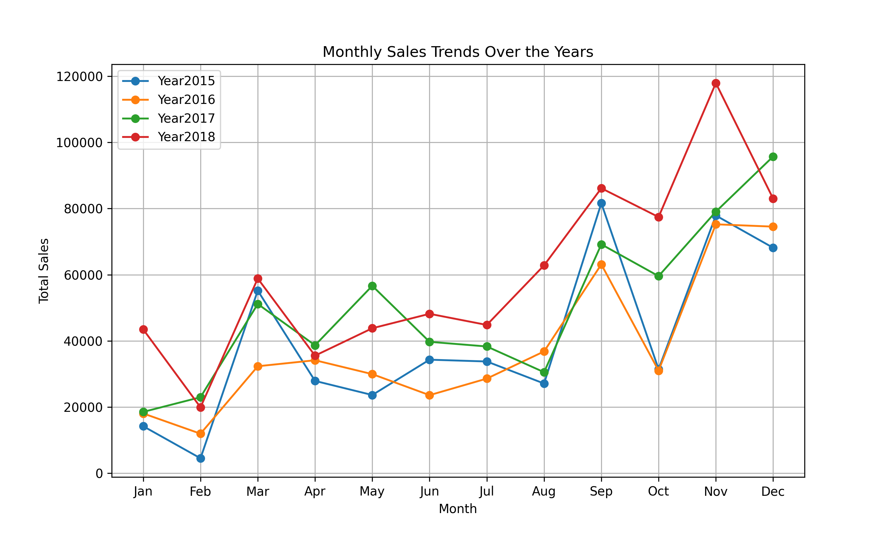
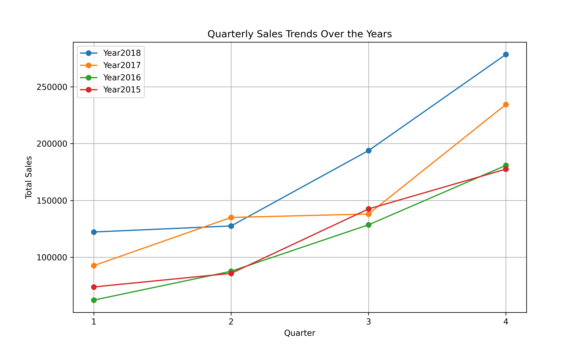
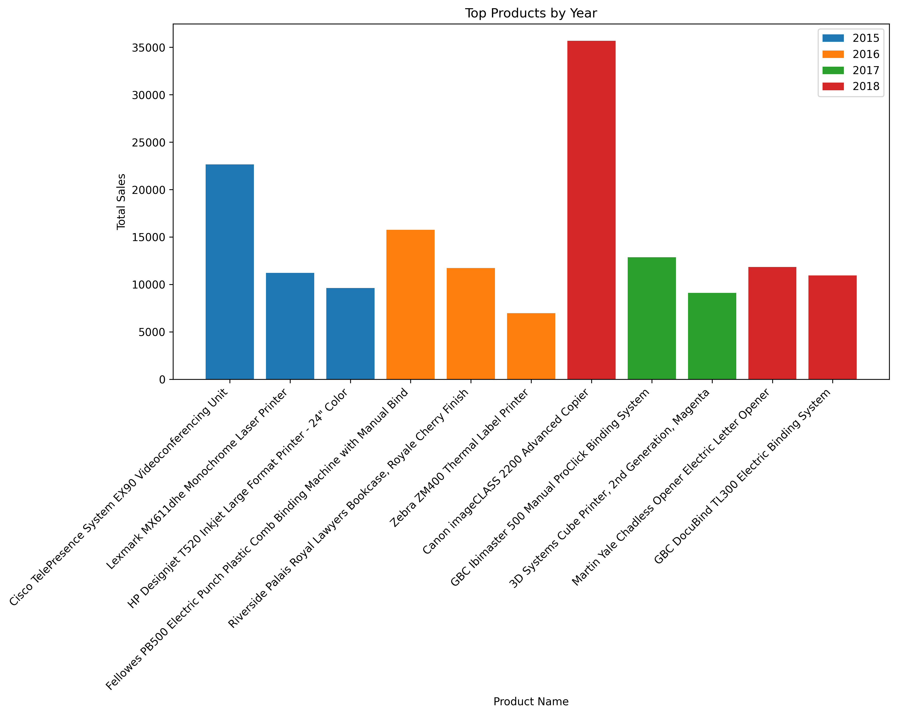

# 📊 Sales Analysts | Superstore Sales Forecast & Trends

### 🛍️ **Project Overview**
This project analyzes Superstore sales data using **Python, Pandas, and Matplotlib** to extract key insights into revenue trends, top-performing products, and seasonal sales variations. 

The analysis includes:
✔ Monthly and quarterly sales trends 📈  
✔ Top products by revenue 🏆  
✔ Most successful sales quarters 🔥  
✔ Forecasting insights based on past trends 📊  

---

## 📂 **Dataset Overview**
The dataset consists of sales transactions with key columns:
- `Order Date` – Date when the order was placed.
- `Sales` – Total revenue generated.
- `Product Name` – The name of the product sold.
- `Year` – Extracted year from the `Order Date` column.
- `Quarter` – Extracted quarter for trend analysis.

---

## 📊 **Key Insights**
🔹 **Sales Growth:** Yearly revenue has shown an increasing trend.  
🔹 **Best Products:** The top-performing products contribute significantly to overall revenue.  
🔹 **Seasonal Trends:** Sales peak during Q4, likely due to holiday shopping.

---

## 📊 **Visualizations**
### **📅 Monthly Sales Trends**


### **📈 Quarterly Sales Trends**


### **🏆 Top Products by Year**


---

## 🚀 **How to Run the Notebook**
1. Clone the repository:
   ```bash
   git clone https://github.com/KameishaSmithData/Sales_Analysts.git

2. Open Jupyter Notebook or Google Colab.
3. Run sales_analysis.ipynb to generate insights.


📬 Contact

👩🏽‍💻 Kameisha Smith
📩 KameishaSmith1@gmail.com
🚀 GitHub: KameishaSmithData
